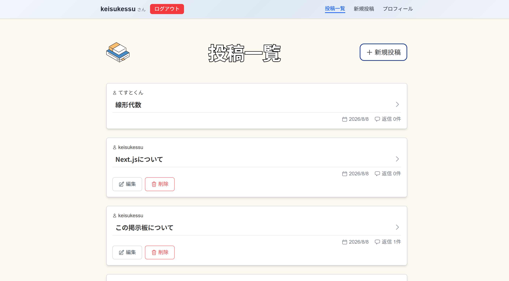
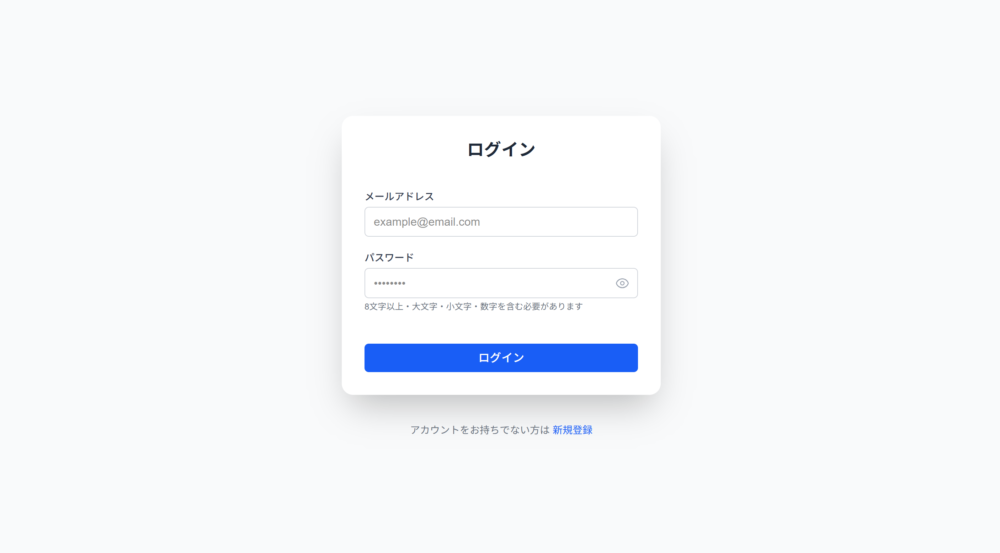
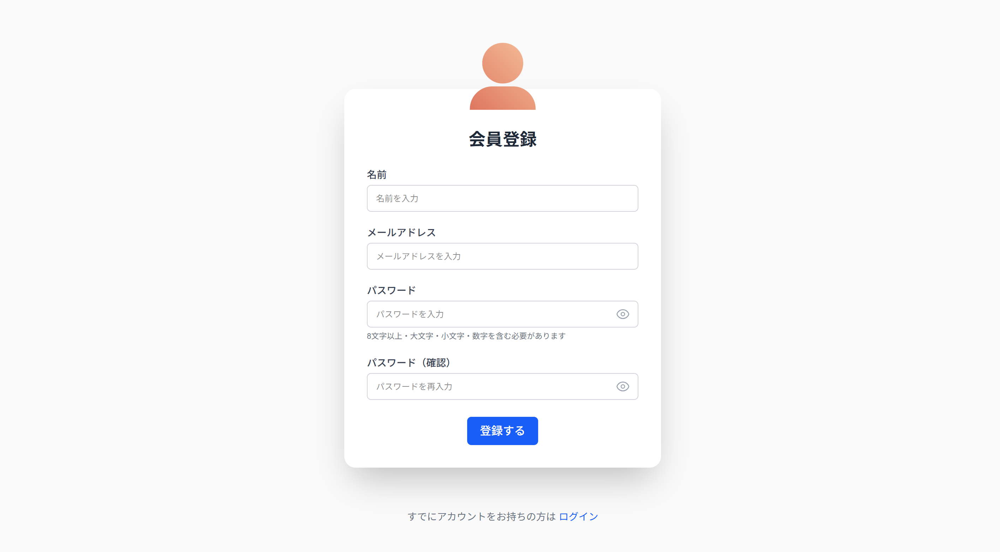
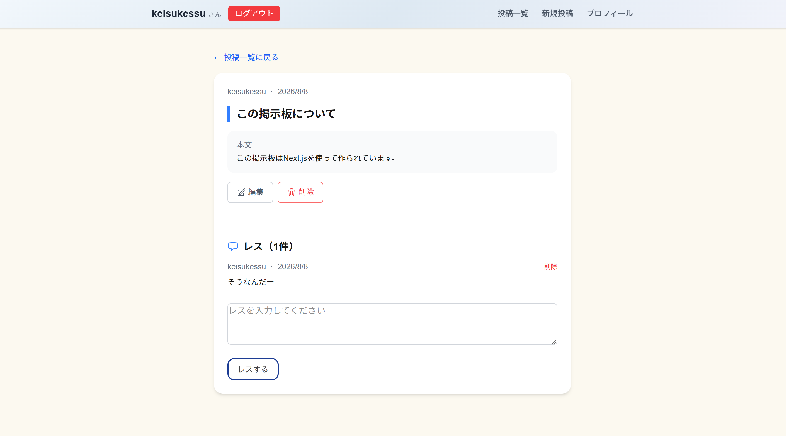
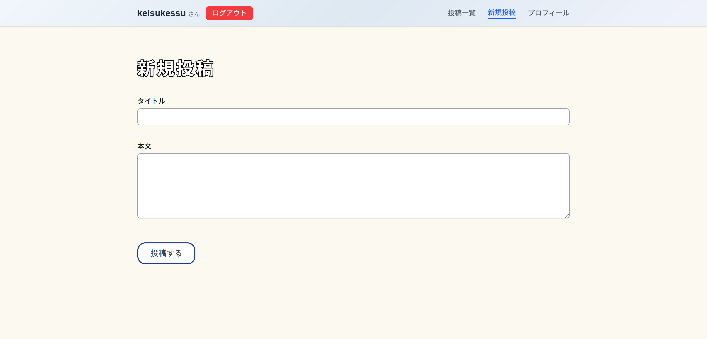
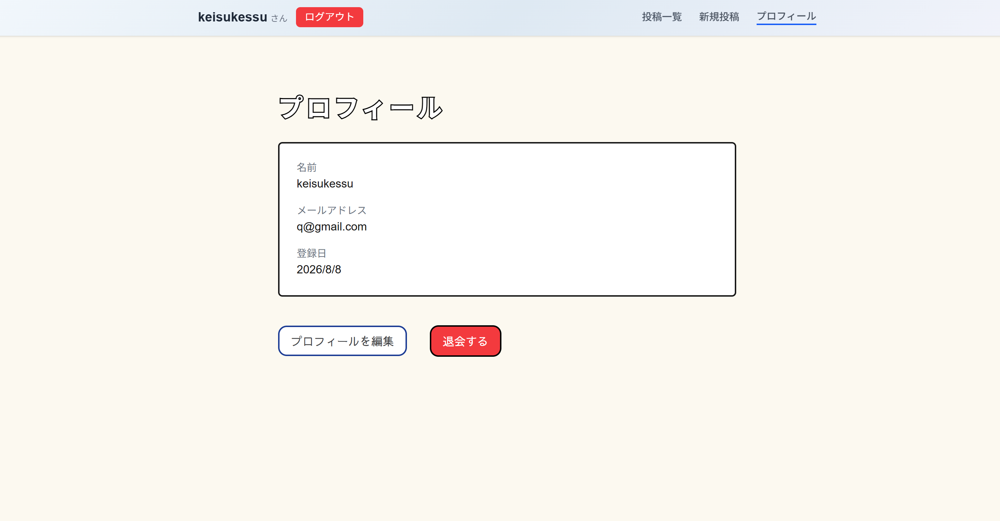
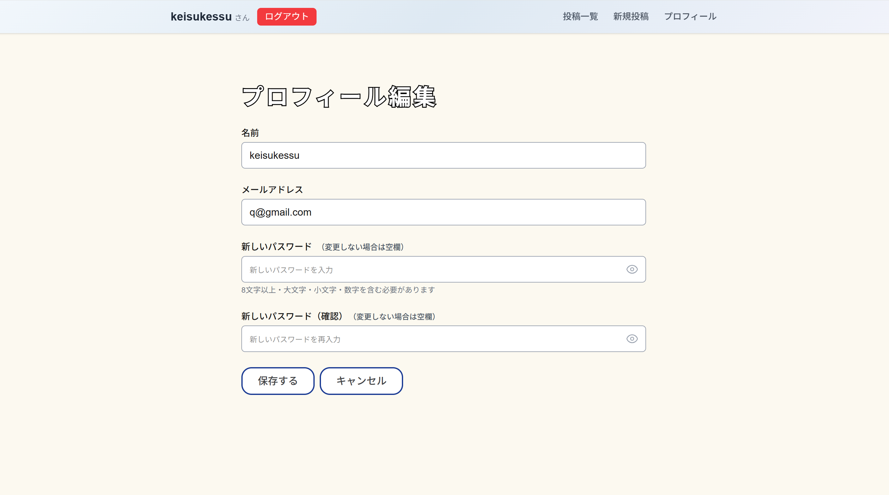

# ログイン式掲示板

## 概要

Next.jsで作成したログイン式の掲示板です。

ユーザー登録・ログインをした状態で、投稿・レスなどができます。

## デモ

🔗サイトURL： [https://next-kadai-eight.vercel.app](https://next-kadai-eight.vercel.app)



## 画面一覧

## 画面一覧

### ログイン


### 会員登録


### 投稿一覧


### 投稿詳細


### 投稿作成


### プロフィール


### プロフィール編集


## 機能一覧

### 認証
- ユーザー登録・ログイン・ログアウト
- プロフィール編集（名前・メールアドレス・パスワード）
- 退会機能（論理削除）
- 登録後の自動ログイン

### 掲示板
- 投稿の作成・編集・削除（論理削除）
- 投稿一覧・詳細表示
- ページネーション

### レス
- レスの作成・削除（論理削除）

### セキュリティ
- CSRF対策（Origin チェック）
- XSS対策（React自動エスケープ）
- SQLインジェクション対策（Prisma ORM）
- bcryptjsでのパスワードハッシュ化

## 技術スタック

### フロントエンド
| 技術 | 説明 |
|------|------|
| Next.js 16 | App Router |
| TypeScript | 型安全な開発 |
| Tailwind CSS v4 | スタイリング |
| React Hook Form | フォーム管理 |
| Zod | バリデーション |

### バックエンド
| 技術 | 説明 |
|------|------|
| Next.js API Routes | APIエンドポイント |
| NextAuth.js | 認証 |
| Prisma 7 | ORM |
| bcryptjs | パスワードハッシュ化 |

### インフラ
| 技術 | 説明 |
|------|------|
| Vercel | ホスティング |
| Prisma Postgres | データベース |
| GitHub Actions | CI/CD |

## システム構成図

```
ユーザー
  ↓
Vercel（Next.js アプリ）
  ↓
Prisma Postgres（クラウドDB）
```

## ER図

```
users
- id          String  @id
- name        String
- email       String  @unique
- password    String
- isDeleted   Boolean
- createdAt   DateTime
- updatedAt   DateTime

posts
- id          String  @id
- title       String
- content     String
- authorId    String  → users.id
- isDeleted   Boolean
- createdAt   DateTime
- updatedAt   DateTime

responses
- id          String  @id
- content     String
- postId      String  → posts.id
- authorId    String  → users.id
- isDeleted   Boolean
- createdAt   DateTime
- updatedAt   DateTime
```

## 画面一覧

| 画面 | URL |
|------|------|
| ログイン | /login |
| 会員登録 | /register |
| 登録完了 | /register/confirm |
| 投稿一覧 | /dashboard |
| 投稿詳細 | /dashboard/posts/[id] |
| 投稿作成 | /dashboard/posts/create |
| 投稿編集 | /dashboard/posts/[id]/edit |
| プロフィール | /dashboard/profile |
| プロフィール編集 | /dashboard/profile/edit |

## セットアップ手順

### 1. リポジトリのクローン

```bash
git clone https://github.com/keisukessu/next_kadai.git
cd next_kadai
```

### 2. 依存関係のインストール

```bash
npm install
```

### 3. 環境変数の設定

```bash
cp .env.example .env
```

`.env` に以下を設定：

```env
DATABASE_URL="your-database-url"
NEXTAUTH_SECRET="your-nextauth-secret"
NEXTAUTH_URL="http://localhost:3000"
```

### 4. DBのセットアップ

```bash
npx prisma migrate dev
npx prisma generate
```

### 5. 開発サーバーの起動

```bash
npm run dev
```

## テスト

```bash
# ユニットテスト・APIテストを実行
npx jest "__tests__/unit" "__tests__/api"

# インテグレーションテストを実行（実際のDBへの接続が必要）
npx jest "__tests__/integration"

# 全テストを実行
npx jest
```